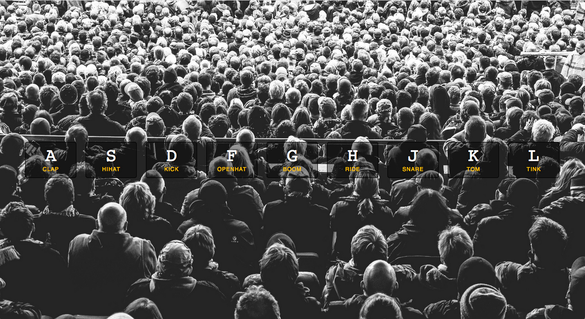

# Drum Kit

## Javascript Drum Kit app using event handler

Javascript Drum Kit App.  When you hit a key on your keyboard, it plays a percussion sound corresponding to that key, and flashes up a short animation on screen.  This is accomplished using an event handler.
