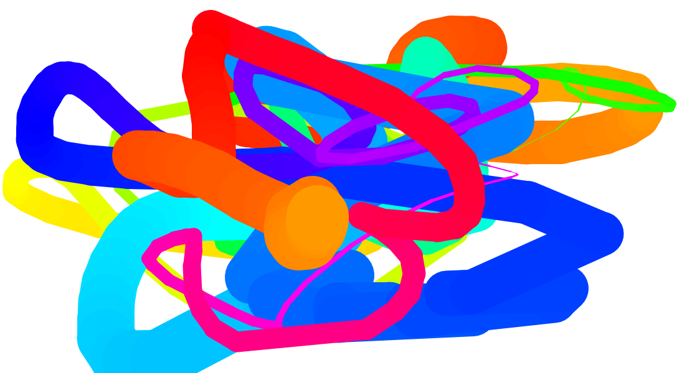

# Paint HTML Canvas

## Javascript Canvas Paint app using mouse event handlers

Javascript Canvas Paint App.  When you click and move the mouse on the screen, the paint color changes and line width changes.  This is accomplished using a series of event handlers, mainly with the mousedown event.
