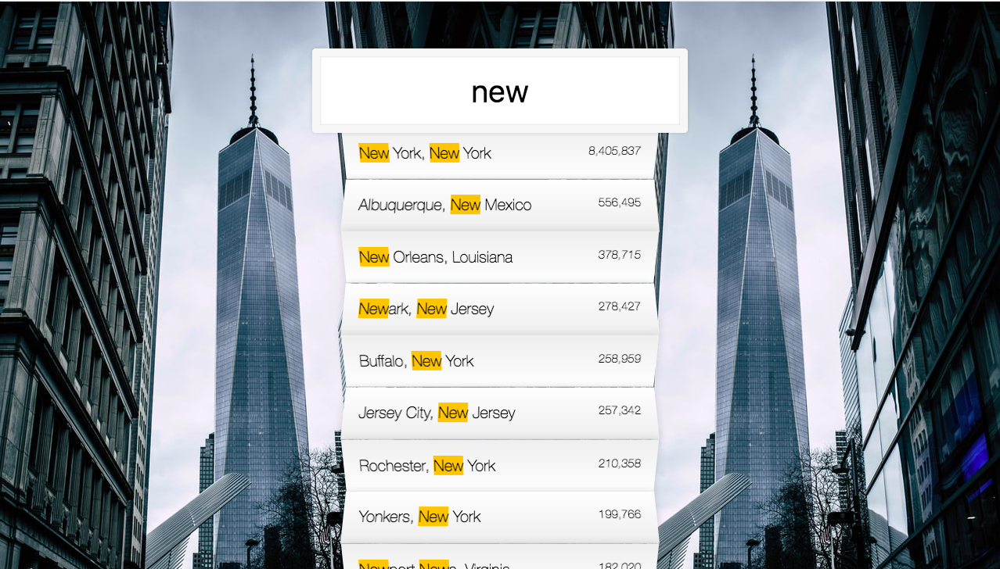

# TypeAhead

## Filter applied to a cities.json file

The app pulls from a cities.json file, and filters results based on user input.  While filtering, the app highlights what the user has already typed into the filter onto the incoming results.  Once narrowed down, the app returns the city, state, and the population.  The app relies on RegExp() and Fetch() logic.
